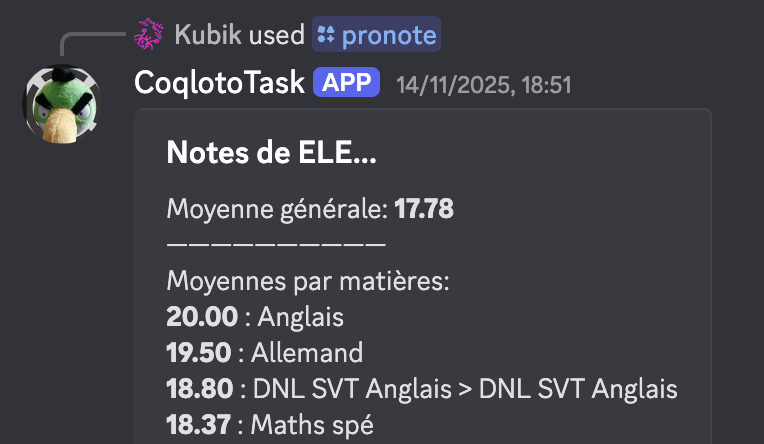
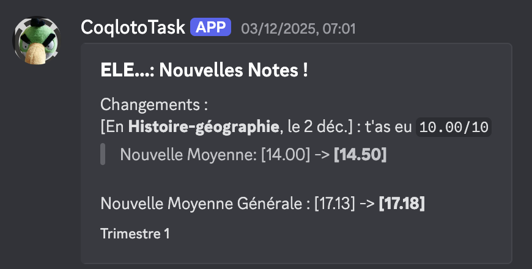
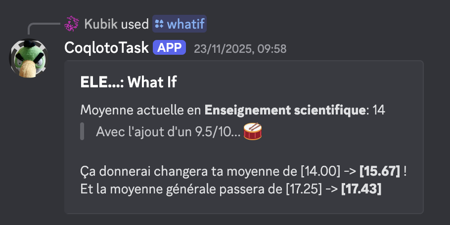

# AutoNote

A bot that will automatically and periodically fetch the grades on the French “Pronote” platform. (and notify on Discord)

## Infos

The bot will automatically fetch every 30 minutes (on the cron interval `1,31 7-22 * * *`) pronote, and notify all changes. Every discord account can only be linked to one account.

Sometimes fetching does not work for some accounts once but works later, probably caused by network lags.

## Installation

You have to install [Bun](https://bun.sh), then `bun install`. You have to edit some configs first:

1. `config.example.ts`
   > Rename this into `config.ts` and change according to your needs!
2. `.env.example`
   > Rename this into `.env` and put your Discord bot token in it

You have to install a playwright browser, like firefox, chromium or webkit. I've put chromium in `util.ts` but you can change it!

```
bunx playwright install chromium
```

## Then run it with

```
bun index.ts
```

There you go!

## Demo

<div align="center">
  

  

  
</div>
